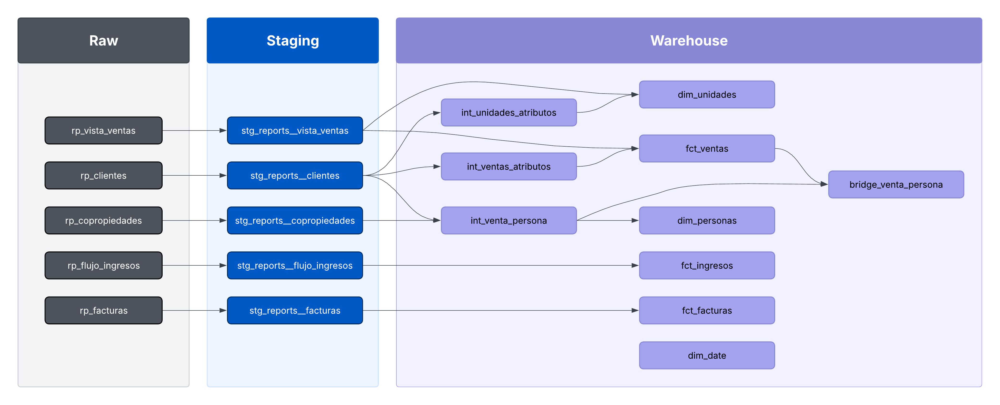
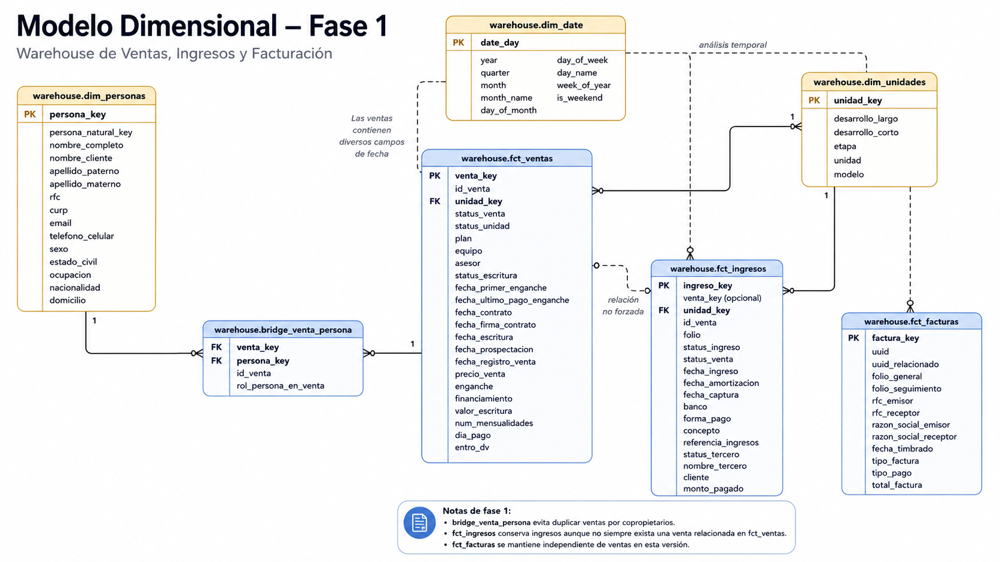

# Proyecto Libera

## 1. ¿Qué es este proyecto?

Este proyecto transforma reportes operativos del CRM en un modelo analítico organizado y reutilizable usando **dbt** y **Databricks**.

En lugar de consultar directamente tablas fuente con columnas mezcladas y reglas dispersas, el proyecto construye una arquitectura por capas para separar:

- datos fuente;
- limpieza y estandarización;
- modelado analítico;
- tablas finales listas para análisis.

En términos simples:

> Este proyecto toma datos comerciales y financieros del CRM y los convierte en una base más clara, consistente y útil para análisis de ventas, cobranza, ingresos y facturación.

---

## 2. Problema que resuelve

Los reportes del CRM contienen información valiosa, pero no están pensados como un modelo analítico final.

Entre los principales retos identificados se encontraron:

- tablas con estructura orientada a reportes, no a análisis;
- columnas repetidas entre varias fuentes;
- llaves no siempre únicas, por ejemplo `folio` en ingresos;
- una venta puede tener varias personas asociadas, como cliente principal y copropietarios;
- algunas relaciones no son completamente confiables, por ejemplo entre facturas y ventas;
- si cada análisis consulta directamente `raw`, la lógica tendría que repetirse muchas veces.

Esto genera riesgos como:

- duplicar ventas en reportes;
- obtener métricas inconsistentes;
- mezclar granos de información;
- dificultar el mantenimiento de dashboards o consultas.

---

## 3. Objetivo del proyecto

El objetivo es construir una base analítica clara y reutilizable que permita responder preguntas de negocio como:

- ¿qué se vendió y en qué desarrollo?
- ¿quién fue el cliente principal y cuántos copropietarios hubo?
- ¿cuánto se vendió contra cuánto se ha cobrado?
- ¿cuánto dinero ingresó por periodo, banco, forma de pago o concepto?
- ¿qué facturas existen y cuánto se ha facturado?

---

## 4. Arquitectura general

El proyecto está organizado en cuatro capas lógicas:

1. **Raw**
2. **Staging**
3. **Warehouse**
4. **Marts**

La idea general es:

```text
raw → staging → warehouse → marts
```

| Capa | Función principal |
| --- | --- |
| `raw` | Conserva los datos fuente tal como llegan desde los reportes del CRM. |
| `staging` | Limpia, renombra, castea y estandariza columnas. |
| `warehouse` | Organiza el negocio en hechos, dimensiones, tablas puente y modelos intermedios. |
| `marts` | Expone tablas finales orientadas a preguntas de negocio. |

---

## 5. Diagrama de lineage principal

Este diagrama muestra el flujo principal desde `raw` hasta `warehouse`.



---

## 6. Capas del proyecto

## 6.1 Raw

La capa `raw` contiene las tablas fuente tal como llegan desde los reportes del CRM.

Estas tablas **no se consideran listas para análisis final**. Su función es servir como fuente de entrada al pipeline.

### Tablas fuente principales

| Tabla raw | Descripción general |
| --- | --- |
| `rp_vista_ventas` | Vista principal de ventas. Contiene una fila por venta observada y sirve como base principal de `fct_ventas`. |
| `rp_clientes` | Información de clientes principales y atributos contractuales asociados a ventas. |
| `rp_copropiedades` | Personas adicionales asociadas a una venta como copropietarios. |
| `rp_flujo_ingresos` | Movimientos de ingreso registrados, con información de banco, forma de pago, concepto y monto pagado. |
| `rp_facturas` | Información de facturación, UUID, RFCs, fecha de timbrado y total facturado. |

---

## 6.2 Staging

La capa `staging` es la primera transformación formal.

Su objetivo es:

- limpiar nombres de columnas;
- estandarizar tipos de datos;
- corregir formatos;
- dejar una versión consistente y más legible de cada tabla fuente.

### Principio de diseño

Cada modelo de staging mantiene una relación cercana con su fuente.

Es decir, `staging` no es todavía la capa de negocio, sino la capa de limpieza y preparación.

### Modelos principales de staging

- `stg_reports__vista_ventas`
- `stg_reports__clientes`
- `stg_reports__copropiedades`
- `stg_reports__flujo_ingresos`
- `stg_reports__facturas`

### Ejemplos de transformaciones típicas

- casteo de fechas;
- estandarización de nombres, por ejemplo `DESARROLLO_LARGO` → `desarrollo_largo`;
- corrección de tipos;
- normalización de columnas para que puedan usarse después en joins y modelos analíticos.

---

## 6.3 Warehouse

La capa `warehouse` es el corazón del proyecto.

Aquí los datos ya no se organizan por “reporte del CRM”, sino por **entidades de negocio**.

En esta capa se construyen:

- **dimensiones**, que aportan contexto descriptivo;
- **hechos**, que representan eventos o transacciones medibles;
- **tabla puente**, para resolver relaciones muchos-a-muchos;
- **modelos intermedios**, que preparan información antes de construir hechos y dimensiones.

### Modelo dimensional de fase 1

El siguiente diagrama muestra cómo se relacionan las principales entidades analíticas del warehouse en esta primera fase:



Este modelo incluye ventas, unidades, personas, ingresos, facturas y fechas. También muestra decisiones importantes como el uso de `bridge_venta_persona` para evitar duplicar ventas por copropietarios, y la independencia de `fct_facturas` respecto a ventas por falta de una llave confiable.

### Estructura del warehouse

```text
warehouse/
  dimensions/
  facts/
  int/
```

---

## 6.3.1 Modelos intermedios

Los modelos intermedios preparan información necesaria antes de construir dimensiones o hechos finales.

### `int_unidades_atributos`

Recupera atributos adicionales de unidades, especialmente `etapa`, usando información de clientes.

**Grano:** 1 fila por `desarrollo_largo + unidad`.

### `int_venta_persona`

Une clientes y copropietarios en una sola estructura lógica, conservando el rol de cada persona en la venta.

Roles principales:

- `cliente_principal`
- `copropietario`

También construye una llave natural de persona con esta jerarquía:

```text
curp → rfc → email → nombre + apellidos + teléfono
```

### `int_ventas_atributos`

Recupera atributos adicionales de venta que no están completos en `rp_vista_ventas`, como:

- `fecha_contrato`
- `fecha_firma_contrato`
- `fecha_escritura`
- `enganche`
- `financiamiento`
- `num_mensualidades`
- `asesor`
- `status_escritura`
- `dia_pago`

**Grano:** 1 fila por `id_venta`.

---

## 6.3.2 Dimensiones

Las dimensiones contienen contexto descriptivo para análisis.

### `dim_unidades`

Representa las unidades observadas en ventas.

**Grano:** 1 fila por `desarrollo_largo + unidad`.

Columnas principales:

- `unidad_key`
- `desarrollo_largo`
- `desarrollo_corto`
- `etapa`
- `unidad`
- `modelo`

**Decisión importante:** `status_unidad` no se incluye aquí porque puede cambiar y se considera más cercano al evento de venta que a la identidad estable de la unidad.

### `dim_personas`

Representa personas deduplicadas, tanto clientes principales como copropietarios.

**Grano:** 1 fila por `persona_natural_key`.

Columnas principales:

- `persona_key`
- `persona_natural_key`
- `nombre_completo`
- `nombre_cliente`
- `apellido_paterno`
- `apellido_materno`
- `rfc`
- `curp`
- `email`
- `telefono_celular`
- `sexo`
- `estado_civil`
- `ocupacion`
- `nacionalidad`
- `domicilio`

### `dim_date`

Dimensión calendario para análisis temporal.

**Grano:** 1 fila por día.

**Rango actual:** `2020-01-01` a `2030-12-31`.

Columnas principales:

- `date_day`
- `year`
- `quarter`
- `month`
- `month_name`
- `day_of_month`
- `day_of_week`
- `day_name`
- `week_of_year`
- `is_weekend`

---

## 6.3.3 Tabla puente

### `bridge_venta_persona`

Resuelve la relación entre ventas y personas.

Se necesita porque una venta puede tener más de una persona asociada, por ejemplo:

- cliente principal;
- uno o varios copropietarios.

**Grano:** 1 fila por `venta_key + persona_key + rol_persona_en_venta`.

Columnas principales:

- `venta_key`
- `persona_key`
- `id_venta`
- `rol_persona_en_venta`

**Decisión importante:** este modelo solo conserva personas ligadas a ventas existentes en `fct_ventas`, para mantener consistencia con la fact principal.

---

## 6.3.4 Facts

### `fct_ventas`

Representa el evento principal de venta.

**Grano:** 1 fila por `id_venta`.

**Fuente principal:** `stg_reports__vista_ventas`.

**Enriquecimiento:** `int_ventas_atributos`.

Columnas principales:

- `venta_key`
- `id_venta`
- `unidad_key`
- `status_venta`
- `status_unidad`
- `plan`
- `equipo`
- `asesor`
- `status_escritura`
- `fecha_primer_enganche`
- `fecha_ultimo_pago_enganche`
- `fecha_contrato`
- `fecha_firma_contrato`
- `fecha_escritura`
- `fecha_prospectacion`
- `fecha_registro_venta`
- `precio_venta`
- `enganche`
- `financiamiento`
- `valor_escritura`
- `num_mensualidades`
- `dia_pago`
- `entro_dv`

**Decisión importante:** `precio_venta` se toma de la vista principal de ventas porque esa tabla tiene una fila limpia por venta.

### `fct_ingresos`

Representa movimientos válidos de ingreso.

**Grano:** 1 fila por movimiento de ingreso válido.

**Fuente principal:** `stg_reports__flujo_ingresos`.

Columnas principales:

- `ingreso_key`
- `venta_key`
- `id_venta`
- `unidad_key`
- `folio`
- `status_ingreso`
- `status_venta`
- `fecha_ingreso`
- `fecha_amortizacion`
- `fecha_captura`
- `banco`
- `forma_pago`
- `concepto`
- `referencia_ingresos`
- `status_tercero`
- `nombre_tercero`
- `cliente`
- `monto_pagado`

Decisiones importantes:

- `folio` no se usa como llave primaria porque no es único;
- se genera `ingreso_key` con una combinación de columnas;
- se excluyen filas vacías o sin `monto_pagado`;
- no se fuerza todavía la relación obligatoria con `fct_ventas`, porque existen ingresos con ventas no presentes en la vista principal.

### `fct_facturas`

Representa facturas emitidas.

**Grano:** 1 fila por factura / UUID.

**Fuente principal:** `stg_reports__facturas`.

Columnas principales:

- `factura_key`
- `uuid`
- `uuid_relacionado`
- `folio_general`
- `folio_seguimiento`
- `rfc_emisor`
- `rfc_receptor`
- `razon_social_emisor`
- `razon_social_receptor`
- `fecha_timbrado`
- `tipo_factura`
- `tipo_pago`
- `total_factura`

**Decisión importante:** no se conecta todavía con ventas porque no existe una llave confiable hacia `fct_ventas`.

---

## 6.4 Marts

La capa `marts` expone modelos finales listos para análisis.

A diferencia del warehouse, aquí los modelos ya están diseñados para responder preguntas concretas de negocio.

### `mart_comercial_ventas`

**Pregunta que responde:** ¿Qué se vendió, en qué desarrollo, qué unidad fue, quién es el cliente principal, cuántos copropietarios hubo y cuál fue el precio de venta?

**Grano:** 1 fila por venta.

**Modelos usados:**

- `fct_ventas`
- `dim_unidades`
- `bridge_venta_persona`
- `dim_personas`

**Lógica importante:** las personas se agregan primero al nivel de venta para evitar duplicar ventas cuando hay copropietarios.

Columnas destacadas:

- `cliente_principal`
- `email_cliente_principal`
- `telefono_cliente_principal`
- `numero_copropietarios`
- `tiene_copropietarios`

### `mart_cobranza_por_venta`

**Pregunta que responde:** ¿Cuánto se vendió, cuánto se ha ingresado y cuánto queda pendiente por venta?

**Grano:** 1 fila por venta.

**Modelos usados:**

- `fct_ventas`
- `fct_ingresos`
- `dim_unidades`

**Lógica importante:** los ingresos se agregan primero por venta antes de unirse a `fct_ventas`, para evitar multiplicar `precio_venta`.

Métricas principales:

- `total_ingresado`
- `saldo_estimado`
- `porcentaje_cobrado`
- `numero_movimientos_ingreso`
- `fecha_primer_ingreso`
- `fecha_ultimo_ingreso`

### `mart_ingresos_por_periodo`

**Pregunta que responde:** ¿Cuánto ingresó por periodo, desarrollo, banco, forma de pago, concepto y estatus?

**Grano:** 1 fila por periodo + atributos financieros.

**Modelos usados:**

- `fct_ingresos`
- `dim_unidades`
- `dim_date`

**Lógica importante:** este mart no depende de `fct_ventas`, porque en el warehouse ya se decidió no forzar ingresos contra ventas cuando la relación no está garantizada.

Métricas principales:

- `numero_movimientos`
- `total_ingresado`

### `mart_facturacion`

**Pregunta que responde:** ¿Qué facturas existen, cuándo se timbraron, quién es el receptor, qué tipo de factura son y cuál fue el total facturado?

**Grano:** 1 fila por factura / UUID.

**Modelos usados:**

- `fct_facturas`
- `dim_date`

**Lógica importante:** se mantiene independiente de ventas porque todavía no existe una llave confiable que las conecte.

---

## 7. Decisiones clave de modelado

Estas son algunas de las decisiones más importantes del proyecto.

### 7.1 Personas y ventas se relacionan con una tabla puente

No se pone `persona_key` directamente en `fct_ventas` porque una venta puede tener varias personas asociadas.

Relación correcta:

```text
fct_ventas ─── bridge_venta_persona ─── dim_personas
```

### 7.2 `fct_ingresos` no se fuerza contra `fct_ventas`

Existen ingresos cuyo `id_venta` no aparece en la vista principal de ventas. Por eso se mantiene independencia en el warehouse y en algunos marts.

### 7.3 `fct_facturas` se mantiene independiente

Las facturas no contienen una llave confiable hacia ventas, por lo que no se inventa una relación.

### 7.4 Se evita duplicar métricas

En los marts, la información de personas o ingresos se agrega primero al nivel correcto antes de unirse a ventas.

Esto evita errores como:

- duplicar `precio_venta` por copropietarios;
- duplicar `precio_venta` por múltiples ingresos.

---

## 8. Calidad de datos y validaciones

El proyecto implementa pruebas con dbt para validar reglas básicas del modelo.

Ejemplos de validaciones:

- llaves no nulas;
- llaves únicas;
- combinaciones únicas;
- relaciones entre facts, dimensions y bridge.

Estas pruebas ayudan a detectar problemas de integridad o cambios inesperados en los datos.

---

## 9. Beneficios del proyecto

Este enfoque aporta beneficios claros tanto para negocio como para equipos técnicos.

### Beneficios de negocio

- reportes más consistentes;
- definiciones más claras de ventas, ingresos y facturación;
- menor riesgo de duplicar métricas;
- mejor capacidad para responder preguntas comerciales y financieras.

### Beneficios técnicos

- lógica centralizada en dbt;
- trazabilidad del lineage;
- pruebas automáticas de calidad;
- modelo reusable para dashboards, consultas o análisis futuros;
- separación clara entre capas y responsabilidades.

---

## 10. Alcance actual

Actualmente el proyecto cubre principalmente:

- ventas;
- personas asociadas a ventas;
- unidades observadas en ventas;
- ingresos;
- facturas;
- marts de ventas, cobranza, ingresos y facturación.

### Fuera del alcance actual

Las tablas relacionadas con ventas canceladas existen, pero todavía no forman parte del modelo principal.

Esto se dejó fuera del alcance inicial para no forzar reglas o relaciones que aún requieren validación adicional.
---
